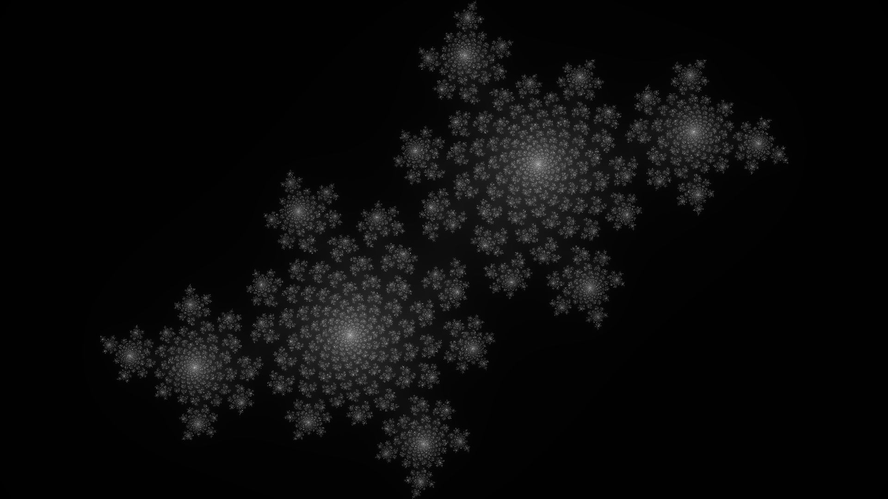

# fraCTL
A simple fractal render from the comfort of your own terminal.

### How to use
`./fractl`


`./fractl --x-constant=-0.4 -y 0.6`


`./fractl -f mandelbrot --x-zoom=-0.745 --y-zoom=0.115 -z 150.0 -g inferno`


`./fractl --help`
```
A small fractal renderer

Usage: ./fractl [OPTIONS]

Options:
  -f, --fractal <fractal>        Fractal type (Julia, Mandelbrot) [default: julia]
  -i, --iterations <iterations>  Amount of iterations [default: 500]
  -w, --width <width>            Width of output image [default: 1920]
  -v, --height <height>          Height of output image [default: 1080]
  -o, --output-name <name>       Name of output image [default: output.png]
  -g, --gradient <gradient>      Gradient to use for the output [default: grayscale]
  -x, --x-constant <x_constant>  Define a complex constant [default: -0.8]
  -y, --y-constant <y_constant>  Define a complex constant [default: 0.156]
  -z, --zoom <zoom>              Define a zoom/magnification to render at [default: 1.0]
      --x-zoom <x_zoom>          Define a coordinate render at [default: 0.0]
      --y-zoom <y_zoom>          Define a coordinate to render at [default: 0.0]
  -h, --help                     Print help
  -V, --version                  Print version
```
